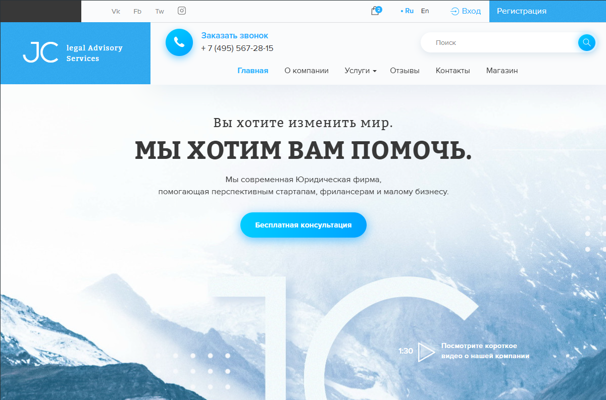

# Lege Theme

Lege is a custom WordPress theme built using [Underscores (_s)](https://underscores.me/) as a base.  
It is converted from an original HTML template into a fully functional WordPress theme.  
The theme features full WooCommerce integration, clean design, and support for customization via Redux Framework.

## Features

- Converted from custom HTML template to WordPress
- Based on _s (Underscores) starter theme
- Fully WooCommerce-compatible
- Translation-ready
- Custom options panel via Redux Framework
- Secure code practices with sanitization and escaping
- Responsive and minimal layout

## Installation

1. Download or clone this repo into your WordPress `/wp-content/themes/` directory.
2. Activate the theme from the WordPress admin panel.

## Screenshot

## Credits

This theme is based on [_s (Underscores)](https://underscores.me/) by Automattic.

## License

GPL-2.0 or later

## Author

Created by Elina Ontisvili  
[GitHub Profile](https://github.com/elinaontisvili)
